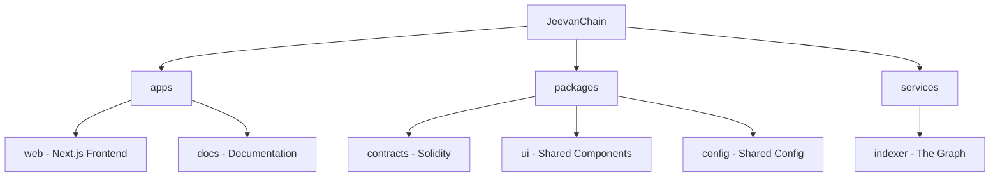

<div align="center">

# 🌟 JeevanChain

> _Empowering Transparent Disaster Relief through Blockchain_

[![Ethereum][ethereum-shield]][ethereum-url]
[![Next.js][next.js-shield]][next.js-url]
[![Solidity][solidity-shield]][solidity-url]
[![MIT License][license-shield]][license-url]
[![LinkedIn][linkedin-shield]][linkedin-url]
[![Twitter][twitter-shield]][twitter-url]

[ethereum-shield]: https://img.shields.io/badge/Ethereum-3C3C3D?style=for-the-badge&logo=ethereum&logoColor=white
[ethereum-url]: https://ethereum.org/
[next.js-shield]: https://img.shields.io/badge/Next.js-black?style=for-the-badge&logo=next.js&logoColor=white
[next.js-url]: https://nextjs.org/
[solidity-shield]: https://img.shields.io/badge/Solidity-%23363636.svg?style=for-the-badge&logo=solidity&logoColor=white
[solidity-url]: https://docs.soliditylang.org/
[license-shield]: https://img.shields.io/badge/License-MIT-green.svg?style=for-the-badge
[license-url]: LICENSE
[linkedin-shield]: https://img.shields.io/badge/LinkedIn-0077B5?style=for-the-badge&logo=linkedin&logoColor=white
[linkedin-url]: https://www.linkedin.com/in/ramkumar9301
[twitter-shield]: https://img.shields.io/badge/Twitter-1DA1F2?style=for-the-badge&logo=twitter&logoColor=white
[twitter-url]: https://x.com/ramkumar_9301


_Building trust in disaster relief through decentralized transparency_

[Live Demo](https://jeevanchain.com) • [Documentation](https://docs.jeevanchain.com) • [Report Bug](https://github.com/kushwahramkumar2003/jeevanchain/issues) • [Request Feature](https://github.com/kushwahramkumar2003/jeevanchain/issues)

</div>

---

## 📋 Table of Contents

<details>
<summary>Click to expand</summary>

- [About The Project](#-about-the-project)
  - [Built With](#-built-with)
- [Features](#-features)
- [Project Structure](#-project-structure)
- [Getting Started](#-getting-started)
  - [Prerequisites](#prerequisites)
  - [Installation](#installation)
- [Usage](#-usage)
- [Roadmap](#-roadmap)
- [Contributing](#-contributing)
- [License](#-license)
- [Contact](#-contact)
- [Acknowledgments](#-acknowledgments)

</details>

## 🌐 About The Project

<div align="center">
  
</div>

JeevanChain revolutionizes disaster relief management by leveraging blockchain technology to ensure:

- 🔍 **Complete Transparency** in fund allocation
- ⚡ **Rapid Response** through smart contract automation
- 🤝 **Community Governance** via DAO structure
- ✅ **Verified Distribution** of aid to genuine beneficiaries

### 🛠️ Built With

<div align="center">

[![React][React.js]][React-url] [![Next][Next.js]][Next-url] [![Solidity][Solidity]][Solidity-url] [![Ethereum][Ethereum]][Ethereum-url] [![TailwindCSS][TailwindCSS]][Tailwind-url] [![TypeScript][TypeScript]][TypeScript-url]

</div>

[React.js]: https://img.shields.io/badge/React-20232A?style=for-the-badge&logo=react&logoColor=61DAFB
[React-url]: https://reactjs.org/
[Next.js]: https://img.shields.io/badge/next.js-000000?style=for-the-badge&logo=nextdotjs&logoColor=white
[Next-url]: https://nextjs.org/
[Solidity]: https://img.shields.io/badge/Solidity-363636?style=for-the-badge&logo=solidity&logoColor=white
[Solidity-url]: https://soliditylang.org/
[Ethereum]: https://img.shields.io/badge/Ethereum-3C3C3D?style=for-the-badge&logo=ethereum&logoColor=white
[Ethereum-url]: https://ethereum.org/
[TailwindCSS]: https://img.shields.io/badge/Tailwind_CSS-38B2AC?style=for-the-badge&logo=tailwind-css&logoColor=white
[Tailwind-url]: https://tailwindcss.com/
[TypeScript]: https://img.shields.io/badge/TypeScript-007ACC?style=for-the-badge&logo=typescript&logoColor=white
[TypeScript-url]: https://www.typescriptlang.org/

## ✨ Features

<div align="center">
  
</div>

🔐 **Smart Contract Security**

- Automated fund distribution
- Multi-sig wallet integration
- Audited by leading security firms

📊 **Real-time Analytics**

- Donation tracking
- Impact measurement
- Fund utilization metrics

🌐 **Global Accessibility**

- Multi-language support
- Cross-chain compatibility
- Mobile-responsive design

🤝 **Community Governance**

- DAO-based decision making
- Transparent voting system
- Community proposals

## 📂 Project Structure



## 🚀 Getting Started

### Prerequisites

- Node.js 18+
- Git
- MetaMask wallet
- Yarn/npm

### Installation

1. Clone the repository

```bash
git clone https://github.com/kushwahramkumar2003/jeevanchain.git
```

2. Install dependencies

```bash
cd jeevanchain
yarn install
```

3. Set up environment variables

```bash
cp .env.example .env.local
# Edit .env.local with your values
```

4. Start development server

```bash
yarn dev
```

## 📱 Usage

<div align="center">
  
</div>

1. **Connect Wallet** - Use MetaMask or WalletConnect
2. **Browse Projects** - View active disaster relief initiatives
3. **Make Donations** - Contribute using ETH or supported tokens
4. **Track Impact** - Monitor your contributions' impact

## 🗺️ Roadmap

- [x] Smart Contract Development
- [x] Frontend Implementation
- [x] DAO Integration
- [ ] Multi-chain Support
- [ ] Mobile App Development
- [ ] AI-powered Verification

## 🤝 Contributing

We welcome contributions! Please check our [Contributing Guidelines](CONTRIBUTING.md).

1. Fork the Project
2. Create your Feature Branch (`git checkout -b feature/AmazingFeature`)
3. Commit your Changes (`git commit -m 'Add some AmazingFeature'`)
4. Push to the Branch (`git push origin feature/AmazingFeature`)
5. Open a Pull Request

## 📄 License

Distributed under the MIT License. See `LICENSE` for more information.

## 📞 Contact

<div align="center">

### Ramkumar Kushwah

[![Twitter][twitter-shield]](https://x.com/ramkumar_9301) [![LinkedIn][linkedin-shield]](https://www.linkedin.com/in/ramkumar9301/) [](https://github.com/kushwahramkumar2003) [](mailto:kushwahramkumar2003@gmail.com)

Project Link: [https://github.com/kushwahramkumar2003/jeevanchain](https://github.com/kushwahramkumar2003/jeevanchain)

</div>

## 🙏 Acknowledgments

- [OpenZeppelin](https://openzeppelin.com/) for smart contract templates
- [The Graph](https://thegraph.com/) for indexing support
- [Ethereum Foundation](https://ethereum.org/) for blockchain infrastructure
- [Chainlink](https://chain.link/) for oracle services

---

<div align="center">

⭐️ **Star us on GitHub — it motivates us a lot!** ⭐️

</div>
